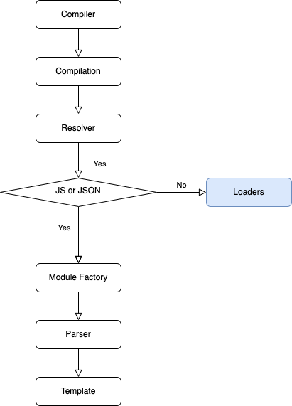

# Plugin开发

### 概述

* ##### 概念
> The plugin interface allows users to tap directly into the compilation process. Plugins can register handlers on lifecycle hooks that run at different points throughout a compilation. When each hook is executed, the plugin will have full access to the current state of the compilation.

> Most of the features within webpack itself use this plugin interface. This makes webpack flexible

> **lifecycle: 记住这个词，后面会考**

* 使用方法
  * 安装
  * 使用
  * 执行时机
    ##### 【TODO: 问号图片】 说来话长
<div style="page-break-after: always;"></div>

### 基础开发
* ##### webpack编译流程<br><br>
  
<div style="page-break-after: always;"></div>

* ##### 生命周期
  1. Compiler
    webpack在开始编译时，做的第一件事儿就是创建`Compiler`对象，并调用其`run`方法。它是webpack的最顶层对象，负责webpack的启动，停止以及资源生成。并有一整套`hooks`函数，用来控制上述流程。
        > https://github.com/webpack/webpack/blob/main/lib/Compiler.js
     
    <br>

  2. Compilation
    在`Compiler`的`run`方法中，创建了compilation的实例。`Compilation`是webpack的核心，在这里webpack开始进行`build`，并最终生成`bundles`

    <br>

  3. Resolver
    我们在`webpack.config.js`中配置的入口文件，会被传递给`Resolver`, `Resolver`会解析`entry`的相对路径是否存在，并转换成全路径并附带context, request等信息。

    <br>

  4. Module Factories
    `Module factories`接收`Resolve`成功解析的request, 并从文件中获取source code（或者是从loader中），创建`Module`实例。

    <br>

  5. Parser
    `Parser`接收`Module`实例，从中获取source code字符串，并将其转换为抽象语法树(AST)。`Parser`会遍历AST，从中找到`require`或`import`语法，然后创建依赖图（`dependency graph`）。然后将这些依赖追加到`Module`实例上。

    <br>

  6. Templates
    被解析的`Module`对象会传递给`template`，最终由`template`生成打包之后的文件。

    <br>

* ##### 钩子方法和`Tapable`库
  * 钩子方法：可以理解为前端框架中的生命周期函数，手动注册回掉函数后，在对应的生命周期事件触发时，回调函数会被调用

    <br>

  * [Tapable](https://github.com/webpack/tapable#tapable): webpack内部所依赖的Hook库，其提供了多种Hook类，可以满足各种应用场景
    * 安装
    ```sh
    npm install --save tapable
    ```
    * 使用
    1. 声明Hook
    ```js
    const { SyncHook } = require("tapable");
    const hook = new SyncHook(['arg1', 'arg2', 'arg3']);
    ```
    2. 注册Hook：之后就可以在该hook上绑定回调，从而监听事件触发
    ```js
    hook.tap('pluginName', () => console.log('========== hook event triggered.'))
    ```
    3. 触发hook事件
    ```js
    hook.call('参数1', '参数2', '参数3')
    ```
    * Hook类型
      * Basic hook
        > This hook simply calls every function it tapped in a row
        
        TODO: 实例<br><br>
      * Waterfall
        > also calls each tapped function in a row. Unlike the basic hook, it passes a return value from each function to the next function

        TODO: 实例<br><br>
      * Bail
        > A bail hook allows exiting early. When any of the tapped function returns anything, the bail hook will stop executing the remaining ones

        TODO: 实例<br><br>
      * Loop
        > When a plugin in a loop hook returns a non-undefined value the hook will restart from the first plugin. It will loop until all plugins return undefined

        TODO: 实例<br><br>
  * webpack中的Hook
    * compiler
      * done
      编译结束时会被执行。
      * thisCompilation
      compilation对象被初始化的时候调用。在compilation事件触发前。
      * compilation
      compilation对象创建后，执行plugin
      * emit
      在资源被放置到output路径之前调用。（通常对编译后的文件进行处理时，监听该事件）
    * compilation
      * optimizeAssets
      将`compilation.assets`中的资源进行优化。
      * optimize
      在优化的开始阶段被触发
* ##### myFirstPlugin
  1. 一个JavaScript命名函数或JavaScript类
  2. 在插件函数的prototype上定义一个apply方法。
  3. 指定一个绑定到webpack自身的事件钩子。
  4. 处理webpack内部实例的特定数据。
  5. 功能完成后调用webpack提供的回调。
  <!-- >>>>>>>>>> 讲师内容 >>>>>>>>>> -->
  #### ***展示代码***
  ```js
  class HelloWorldPlugin {
    apply(compiler) {
      compiler.hooks.done.tap(
        'Hello World Plugin',
        (
          stats /* 绑定 done 钩子后，stats 会作为参数传入。 */
        ) => {
          console.log('Hello World!');
        }
      );
    }
  }

  module.exports = HelloWorldPlugin;
  ```

  ```js
  // webpack.config.js
  var HelloWorldPlugin = require('path/to/HelloWorldPlugin');

  module.exports = {
    // ... 这里是其他配置 ...
    plugins: [new HelloWorldPlugin({ options: true })],
  };
  ```
  <!-- <<<<<<<<<< 讲师内容 <<<<<<<<<< -->
  > 一些说明：
  > 1. apply被调用的时机
  >     参见：https://github.com/webpack/webpack/blob/main/lib/webpack.js

### 读轮子・写轮子
* ##### [HtmlWebpackPlugin](https://github.com/jantimon/html-webpack-plugin)
  * 使用方法
  <!-- >>>>>>>>>> 讲师内容 >>>>>>>>>> -->
  #### ***讲师内容***
  ```js
  // webpack.config.js
  const HtmlWebpackPlugin = require('html-webpack-plugin');

  module.exports = {
    //...其他配置
    {
      entry: 'index.js',
      output: {
        path: __dirname + '/dist',
        filename: 'index_bundle.js'
      },
      plugins: [
        new HtmlWebpackPlugin({
          title: 'Custom template',
          // Load a custom template (lodash by default)
          template: 'index.html'
        })
      ]
    }
  }
  ```
  ```html
  <!-- index.html -->
  <!DOCTYPE html>
  <html>
    <head>
      <meta charset="utf-8"/>
      <title><%= htmlWebpackPlugin.options.title %></title>
    </head>
    <body>
    </body>
  </html>
  ```

  报错：
  ##### TODO:
  <!-- <<<<<<<<<< 讲师内容 <<<<<<<<<< -->
  * 源码解析
  ```js
  class HtmlWebpackPlugin {
    apply(compiler) {

    }
  }
  ```
* ##### CopyPlugin

### 插件开发